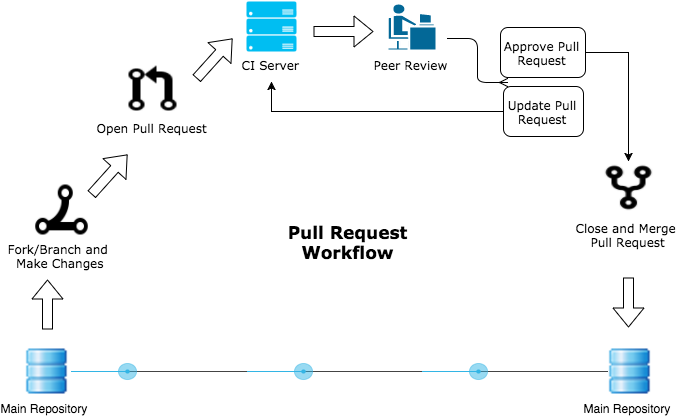
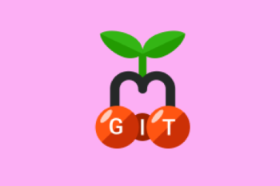
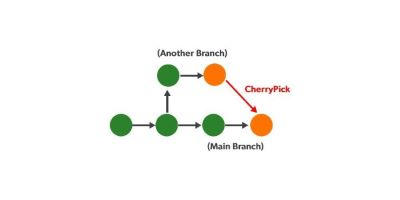
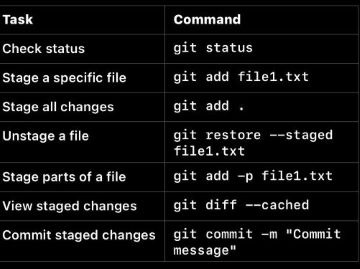
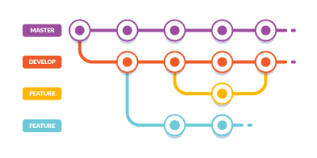
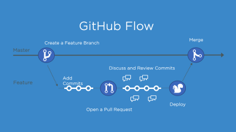
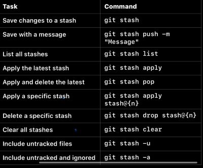

# Git and GitHub 💻

|                                                  |
|:------------------------------------------------------------------------------:|
|                 [*Click here to visit GitHub*](https://github.com/)            |

********
## **Key terms** 📑
- **Repository:** A  project folder containing all files and history

- **Branch:** A parallel version of your codebase to work on without affecting the main code

- **Merge:** Combing changes from one branch to another

- **Conflict:** When two branches have conflicting changes that must be resolved manually

- **Forking:** Copying the original repo, make changes and add new features or fix bugs, without changing the original project

- **Cherry-Picking:** The process of selecting specific commits from one branch and applying them to another, being able to apply a specific change without merging an entire branch

- **Staging area:** A space where you prepare your changes before committing them, like a draft

- **CI Pipeline:** Continuous Integration - frequently integrating code changes into a shared repository

- **CD Pipeline:** Continuous Delivery - ensures software is always in a deployable state

- **Support cycles:** the duration during which a software product, operating system or service receives updates, bug fixes and technical support from its developer

 

> ### **Pull Requests** ↪️

- Pull requests can only be opened between two branches that are different
    - You can specify which branch you'd like to merge your changes into when you create your pull request.
    - Create a branch 
    - You must be a member of the organization that owns the repository to open a pull request
    - Ensures code is high quality and meets project requirements

>>**Step by Step**
1. Fork/Clone the repository
2. Create a branch
3. Make changes
4. Commit and push
5. Pull request and select the branch you worked on and compare it with the main branch
6. Other team members can review your changes and leave comments or suggest edits
7. Make changes and commit and push
8. Merge

>### **Cherry-Picking** 🍒	
>>**When to use:**
- Fixing bugs
- Avoiding merge conflicts
 - Applying a specific feature to multiple branches

>>**Step by Step:**
1. Identify the commit (git log)- find the SHA
2. Checkout the target branch eg. Git checkout main
3. Cherry-pick the commit eg. Git cherry-pick a1b2c3d
 4. Git push
5. To cherry-pick multiple commits you can separate each with a space

>### **Staging in Git**
>>**Key concepts:**
- Untracked changes - files or changes which git doesn’t yet recognise
- Staged changes - ready to be committed
- Committed changes - changes stored in the Git repository's history
>>**Workflow for Staging:**
1. Git status 
2. Stage your changes (See command table)
3. Commit staged changes
4. Unstaging if necessary - this can move our filed back to unstaged
    

>### **Git Flow**
A branching mode that requires schedule releases, best for long-term projects

>>**Key Branches**
 - Main/Master 
 - Develop - the default branch for ongoing development

>>**Supporting Branches**
- Feature - merges into develop when complete
- Release - merged into both develop and main when preparing for a release
- Hotfix - Created from main for urgent fixes

>### **GitHub Flow**
Designed for projects with continuous delivery 
Best for projects that deploy frequently and smaller teams
>>**Key Principles:**
- Main
- Feature

>### **Git Stash**
A feature that allows you to save your uncommitted changes temporarily without committing them to the repository, useful for when you need to switch branches
>>**How it works**
1. Stashing changes - save the current state in a 'stash'  and revert your working directory to a clean state
2. Applying the most recent stash back to your working directory
3. Use git stash drop to drop the most recent stash
4. You can stash specific files e.g. Git stash push -m  ""  file1.txt

>### **Branching Strategies** ⤵️
>>A branching strategy is a strategy that software development teams adopt for writing, merging and deploying code with the help of a version control system like Git. 
It lays down a set of rules that aid the developers on how to go about the development process and interact with a shared codebase. 

>>**How to choose a strategy:**
1. Team size - larger teams = more structure = Git Flow
2. Release frequency - higher frequency = GitHub Flow or TBD
3. Project type 
4. Tooling

|Branching Strategy |What is it best for? |Key Features |Workflow |
| :-----------------: | ------------------- | ----------- | ------- |
| GitFlow           |Large Projects with scheduled releases |Defines distinct branches for development, releases and hotfixes |1. Create feature branches from develop and merge it back 2. Release branch is made for testing  3. Release branch is merged into both main and develop |
| GitHub Flow       |Teams using continuous delivery |Simplistic approach Developers work on feature branches, open pull requests and merge back into main after approval |1. Create a new branch from main for each feature/bug fix 2. Push branch to GitHub and open a pull request  3. Once approved, merges into main |
| GitLab Flow       |Teams using GitLab's built in CI/CD pipelines *See key term bank* |Combines aspects of Git Flow and GitHub Flow |1. Create feature branches and merge them into environment branches e.g. Staging 2. After testing, changes are merged into production for development |
| Trunk-based Development |High velocity teams using DevOps or CI/CD |Committing small changes directly to main Reduces merge conflicts by minimizing branch divergence Encourages frequent commits and fast delivery |1. All work happens directly on main or short-lived branches 2. Code is continuously integrated and deployed |
| Release Branching |Projects with multiple versions in production |Maintains separate branches for each release Useful for software with long support cycles |1. A branch is created for each release 2. Hotfixes or updates are committed to the corresponding release branch 3. Changes marge into main or develop |
|Feature Branching |Teams focusing on specific, isolated features |Creating a branch for every feature Each feature branch is merged into main or develop when completed Easy to track progress for each feature |1. Create a branch for the feature e.g. git checkout -b feature/add-login 2. Work on the branch independently 3. Merge into the parent branch once done |
|Forking Workflow |Open source projects |Fork the main repository and create pull requests for their changes Ensures security Provides a clear separation of contributors' work |1. Fork the repository into their personal account 2. Create a branch, make changes and push to the forked repository 3. Open a PR to merge changes into the original repository |

